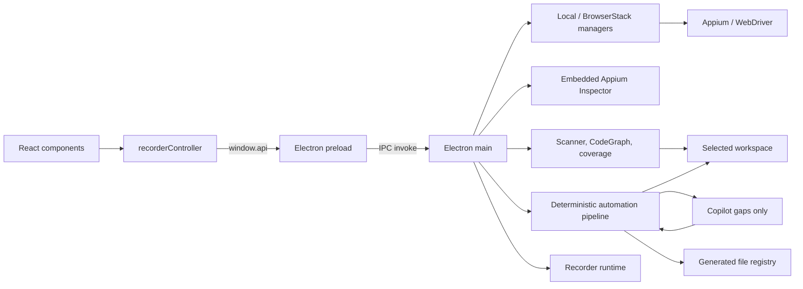

# Arquitectura

## Propósito

Appium Visual Recorder inspecciona y manipula una app móvil, registra acciones,
construye Gherkin y genera automatización compatible con `fwk-mobile-test`.
Funciona exclusivamente embebido en `tools/visual-recorder` dentro del framework.

## Vista de componentes

El límite de confianza está entre `preload` y `main`: el renderer recibe una
API limitada, mientras que filesystem, red de BrowserStack, procesos y driver
permanecen en el proceso principal.

## Capas y responsabilidades

### Renderer

- `renderer/components/`: estructura visual React.
- `renderer/App.tsx`: montaje y ciclo de vida principal.
- `renderer/controller/recorderController.js`: estado y comportamiento
  imperativo heredado, bindings de DOM y coordinación con `window.api`.
- `renderer/global.d.ts`: contrato TypeScript de la API expuesta.
- `renderer/recorder.css`: layout, scroll y estados visuales.

React es dueño del markup, pero el controlador todavía depende de IDs JSX.
Esta convivencia debe reducirse gradualmente, componente por componente; no se
debe hacer una segunda migración total ni duplicar listeners.

### Bridge y proceso principal

- `recorder/src/preload.ts`: allowlist de funciones IPC.
- `recorder/src/main.ts`: ventana, lifecycle, composición de servicios y
  handlers IPC.
- `recorder/src/mobileInspector.ts`: jerarquía y selección visual.
- `recorder/src/featureGenerator.ts`: apoyo a previsualización Gherkin.

`BrowserWindow` debe conservar `nodeIntegration: false` y
`contextIsolation: true`.

El Inspector oficial se consume desde el fork controlado fijado como submódulo
en `vendor/appium-inspector`. Su bundle browser no se versiona: se compila en la
caché local con `npm run inspector:build`. Una `BrowserWindow` aislada sirve un
host y el bundle mediante orígenes locales `appium-recorder://host` y
`appium-recorder://inspector`; no acepta navegación ni ventanas nuevas. El
renderer principal nunca recibe WebDriver ni datos de sesión: solo el selector
confirmado explícitamente por el protocolo `appium-inspector:embedded` versión
3 mediante `appium-inspector:element-used`. El host delega al iframe únicamente
`clipboard-write` para copiar selectores; no concede lectura del portapapeles ni
otras capacidades y conserva sandbox, CSP y orígenes distintos.

### Dominio (`core/`)

| Área | Módulos principales | Responsabilidad |
|---|---|---|
| Sesión | `appiumDriverManager`, `browserStackDriverManager`, `mobileStepExecutor` | Conectar, capturar, tocar, gestos y ejecutar acciones |
| Workspace | `projectPaths`, `workspaceAdapter`, `frameworkScanner` | Resolver la raíz padre y el catálogo del framework |
| Automatización | `automationRecordingStore`, `deterministicResolver`, `automationContextProjections`, `automationPackageBuilder` | Recording, plan, hints/gaps derivados y contexto mínimo |
| IA acotada | `automationAgentLauncher`, `automationContracts` | Abrir Terminal en el paquete y entregar un prompt acotado; el usuario inicia el agente |
| Validación/memoria | `automationResponseValidator`, `automationMemory` | Validar, reparar una vez y versionar score 100 |
| Generación | `fwkMobileGenerator`, `generationQuality` | Construir previews y contenidos |
| Seguridad de salida | `outputValidator`, `generatedFileRegistry` | Rutas permitidas, sintaxis, hashes y escritura segura |
| Análisis | `reuseAnalyzer`, `scenarioCoverageAnalyzer` | Impacto de steps y cobertura Android/iOS |
| Indexación | `codeGraph`, `frameworkQueryService`, `recorderCodeGraph`, exporters | Inventario incremental único y consultas acotadas del framework; grafo separado del propio recorder |
| Política contextual | `gapQueryPolicy` | Autorizar consultas solo para gaps abiertos, con allowlist, deduplicación y presupuesto |
| Observabilidad | `agentRunStore` | Métricas seguras por ejecución en `agent-run.json` |
| Modelo | `models` | Acciones, steps y tipos compartidos |

## Workspace

La raíz se deriva de la ubicación instalada:
`fwk-mobile-test/tools/visual-recorder`. No se lee `.env` ni un archivo de
workspace para cambiar el target. Todas las rutas operativas nacen en
`core/projectPaths.ts` y el adaptador valida el framework antes de abrir la UI.

## Flujos principales

### Arranque y sesión

1. Se resuelve e inicializa el workspace.
2. Antes de abrir la ventana se eliminan únicamente placeholders de recordings
   que tengan manifest válido, cero acciones y ningún scenario ni evidencia.
3. El scanner entrega ambientes, squads, apps y conteos sin revelar valores
   sensibles de `config/envs/.env.*` del framework.
4. El usuario elige conexión local o BrowserStack.
5. `main` crea el driver correspondiente y fija la plataforma de la sesión.
6. Screenshot, XML, taps, swipes y ejecución pasan siempre por IPC.
7. En modo embebido, `main` entrega al Inspector la sesión local ya creada. El
   recorder conserva propiedad exclusiva y cierra la sesión; el Inspector solo
   se adjunta mediante un proxy loopback efímero que acepta exclusivamente el
   origen local del Inspector y las rutas de la sesión activa. El Inspector
   mantiene la selección local hasta que el QA pulsa **Usar en Recorder**. Solo
   entonces emite el selector confirmado; el recorder oculta la ventana sin
   destruirla y conserva sesión, proxy y selección para la siguiente apertura.

El evento v3 incluye hasta 50 candidatos que el Inspector ya comprobó como
únicos y pertenecientes al mismo elemento WebDriver. Esa comprobación no cruza
el límite de confianza: `main` vuelve a ejecutar todos los candidatos
secuencialmente contra la sesión activa, exige una sola coincidencia con el
`elementId` seleccionado y comprueba que el par real `(TypeLocator, valor)`
reconstruya el mismo elemento. El primary inválido rechaza la importación; las
alternativas inválidas o con estrategia todavía no soportada se aíslan y omiten
con diagnóstico. Una estrategia no soportada en el primary bloquea visiblemente.
Solo se conservan cuatro
candidatos compactos y nunca atributos, XML, screenshots, source, capabilities
o credenciales. Validaciones solapadas llevan una generación monotónica: solo
la selección más reciente puede publicar candidatos. Ejecutar una acción no
convierte por sí solo un selector manual en verificado.

### Caso nuevo con agente de automatización

1. El recorder persiste acciones ordenadas, la intención funcional escrita por
   el QA y selectores comprobados. El QA no asigna nombres técnicos de locator.
2. El usuario define objetivo y aceptación; no redacta Gherkin manualmente.
3. `ReuseAnalyzer` construye una vista compacta de escenarios, steps y locators
   del squad, Home y commons. Normaliza los selectores al par
   `(TypeLocator, valor)` que compone el framework (ver `locatorStrategy`).
4. `DeterministicResolver` decide reuse/create/builtin, detecta casos equivalentes
   y fija las cuatro rutas.
5. Se escriben `generation-plan.json`, `reuse-context.json`,
   `collision-report.json`, contextos resuelto/no resuelto y contrato
   bajo `runtime/recordings/<id>/generation/automation`.
   `locator-candidates.json` es la única copia compacta de los backups
   verificados dentro del paquete; `scenario.json` no los duplica. Al importar,
   `main` toma el `scenario.json` original del recording como fuente autoritativa,
   reconstruye con el mismo resolver su normalización y representación compacta,
   y rechaza cambios tanto en ese escenario esperado como en la allowlist
   expuesta al agente.
6. Si existe un caso equivalente con sus cuatro capas, se conserva localmente y
   no se invoca al agente. La memoria de calidad 100 también se reutiliza.
7. La UI abre Terminal en el paquete y muestra el prompt inicial. El usuario
   inicia Copilot manualmente; el agente recibe solo gaps y un contexto
   máximo de 20 KB, con objetivo operativo de 5 min.
8. `AutomationResponseValidator` exige cuatro capas, trazabilidad y `Then`, y
   bloquea colisiones contra el framework aunque el agente ignore el contexto.
   Los rellenos de plataforma solo aceptan la identidad determinista completa
   `(file, module, block, name, platform, sequence)` y el método trazado debe
   consumir ese getter; el patch conserva esa misma identidad hasta la escritura.
   Los completions externos se aplican incluso cuando las cuatro capas del caso
   son `create`; no dependen de que exista un `update` en el plan.
9. Puede emitirse una sola reparación dirigida a archivos afectados.
10. El usuario revisa el preview, genera y recién entonces se promociona memoria.

### Observabilidad por ejecución

Cada preparación real inicia
`runtime/recordings/<id>/generation/automation/agent-run.json`. El mismo
artefacto se actualiza durante resolución, apertura manual del agente,
validación, reparación y generación, incluso si el flujo termina con error.
Registra duraciones, lecturas del índice, bytes de contexto/respuesta, intentos
de reparación y resultado. `tokensInput` y `tokensOutput` permanecen en `null`
mientras el CLI no exponga esos datos. No almacena prompts, XML, capturas,
selectores, secretos ni mensajes de error.

### Índice y consultas del framework

`CodeGraph` es la fuente autoritativa del inventario de Features, Steps, Screen
Objects y locators. Su cache compara `mtime` y tamaño por archivo: una consulta
en frío indexa el framework, una consulta caliente reutiliza todos los nodos y
una modificación reindexa únicamente los archivos cambiados antes de reconstruir
relaciones derivadas.

`FrameworkQueryService` expone respuestas JSON pequeñas para
`inspectScenario`, `findExistingScreen`, `findExistingStep`, `findExample`,
`findLocator`, `getContract`, `getHelperApi` y `validateImports`. Todas aplican
límites de resultados/bytes, devuelven rutas, símbolos, firmas y relaciones,
y reportan `cacheHit`, archivos examinados/leídos y bytes leídos. Nunca incluyen
el contenido completo de un archivo por defecto.

`ReuseAnalyzer` conserva su contrato para no romper el resolver ni el scanner,
pero obtiene del CodeGraph el inventario y la revisión del framework y cachea
el catálogo por revisión, squad, plataforma y feature scope. Ya no descubre
Steps ni Screen Objects con un segundo recorrido independiente. La migración
de sus analizadores de contenido restantes será gradual.

### Hints, gaps y política de consultas

Después del resolver, `automationContextProjections` deriva dos vistas compactas:
`hints.json` describe decisiones que ya tienen evidencia y `gaps.json` normaliza
únicamente lo que continúa faltando. Son proyecciones de `GenerationPlan`,
`resolved-context.json` y `unresolved-context.json`; no reemplazan esas fuentes.

La confianza no se estima libremente: coincidencias exactas, selectores
verificados y contratos resueltos valen `1`; las relaciones usan el score ya
calculado por el índice/resolver. Una relación sin score no genera hint.

`GapQueryPolicy` es la entrada para consultas contextuales. Sin gap abierto
rechaza antes de tocar CodeGraph. Con gap abierto solo acepta `allowedQueries`
hasta `maxQueries`, evita solicitudes idénticas y deja de consultar al resolver
el gap. Los gaps `blocked-qa` tienen presupuesto cero. En esta fase la política
se valida determinísticamente; todavía no existe orquestador ni integración CLI.

### Completar plataforma de un caso existente

1. Se listan únicamente grabaciones de `runtime/recordings` que coincidan con
   el ambiente y squad activos; no se enumeran Features del target.
2. `recordingId` identifica el caso y permite retomarlo entre sesiones.
3. El analizador reconstruye acciones → plan → locators generados y muestra la
   cobertura en el orden del recording.
4. El inspector asigna el selector al locator objetivo.
5. Se actualiza únicamente Android o iOS, según la sesión activa. El recorder
   conserva la otra plataforma, sincroniza la estrategia técnica del getter y
   reemplaza atómicamente el locator administrado en el target.
6. La propuesta persistida del recording recibe el mismo valor. Al completar
   la cola, el caso queda marcado como completo para esa plataforma y no vuelve
   a requerir Cowork ni regeneración de Feature/Steps.

### Regenerar una automatización importada

1. La UI lista únicamente recordings con propuesta validada al 100% y las
   cuatro capas ya presentes en el workspace.
2. El QA selecciona el recording y describe el refinamiento funcional.
3. El recorder guarda la versión anterior bajo
   `generation/automation/history/regeneration-NNN`, conserva `recordingId` y
   fija un nuevo `planId` para impedir importar accidentalmente la respuesta
   anterior.
4. El agente recibe `baseline-response.json`, el plan y el contexto mínimo; no
   vuelve a explorar el framework ni puede cambiar rutas o selectores
   verificados.
5. La nueva propuesta atraviesa el mismo validator, preview y revisión. Solo
   archivos administrados, sin cambios externos, pueden reemplazarse
   atómicamente en el target.
6. Una generación válida crea una nueva versión de memoria y deja el estado
   del recording en `generated`, permitiendo futuras iteraciones.

## Contrato IPC

Las familias públicas son:

- catálogo/workspace: `scan-framework`, `get-workspace-info`,
  `get-squad-catalog`;
- impacto/cobertura: `analyze-step-impact`, `get-existing-scenarios`,
  `get-scenario-coverage`, `assign-locator-value`;
- sesión local y BrowserStack: devices, apps, credenciales y start/close;
- interacción: screenshot, page source, element-at, tap, swipe, verify y execute;
- Inspector embebido: abrir/focalizar y eventos acotados de conexión, error y
  uso explícito del selector;
- automatización: preparar paquete, lanzar agente, importar respuesta, generar
  con token, preparar regeneración y consultar memoria;
- generación heredada: preview Gherkin, preview de archivos y generación.

Al añadir un canal, actualiza en conjunto handler de `main.ts`, allowlist de
`preload.ts`, `renderer/global.d.ts`, consumidor y pruebas. Valida todo payload
en el proceso principal: TypeScript en el renderer no es una frontera de
seguridad.

## Decisiones y deuda conocida

- La mayor parte de la generación es determinista. La IA externa es opt-in y
  se limita a gaps explícitos; nunca recibe el repositorio completo.
- `recorderController.js` sigue siendo grande e imperativo. Las extracciones
  futuras deben mantener un único dueño por estado y evento.
- `dist/` no se limpia automáticamente antes de `tsc`; nunca se usa para
  inferir la arquitectura vigente.
- Los archivos de runtime son estado local, no fuente.
