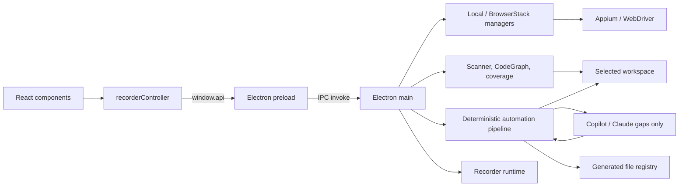

# Arquitectura

## Propósito

Appium Visual Recorder inspecciona y manipula una app móvil, registra acciones,
construye Gherkin y genera automatización compatible con un workspace elegido.
Funciona embebido en `fwk-mobile-test`, como workspace standalone o como
grabador neutral.

## Vista de componentes

El límite de confianza está entre `preload` y `main`: el renderer recibe una
API limitada, mientras que filesystem, red de BrowserStack, procesos y driver
permanecen en el proceso principal.

## Capas y responsabilidades

### Renderer

- `renderer/components/`: estructura visual React.
- `renderer/App.tsx`: montaje y ciclo de vida principal.
- `renderer/controller/recorderController.js`: estado y comportamiento
  imperativo heredado, bindings de DOM y coordinación con `window.api`.
- `renderer/global.d.ts`: contrato TypeScript de la API expuesta.
- `renderer/recorder.css`: layout, scroll y estados visuales.

React es dueño del markup, pero el controlador todavía depende de IDs JSX.
Esta convivencia debe reducirse gradualmente, componente por componente; no se
debe hacer una segunda migración total ni duplicar listeners.

### Bridge y proceso principal

- `recorder/src/preload.ts`: allowlist de funciones IPC.
- `recorder/src/main.ts`: ventana, lifecycle, composición de servicios y
  handlers IPC.
- `recorder/src/mobileInspector.ts`: jerarquía y selección visual.
- `recorder/src/featureGenerator.ts`: apoyo a previsualización Gherkin.

`BrowserWindow` debe conservar `nodeIntegration: false` y
`contextIsolation: true`.

### Dominio (`core/`)

| Área | Módulos principales | Responsabilidad |
|---|---|---|
| Sesión | `appiumDriverManager`, `browserStackDriverManager`, `mobileStepExecutor` | Conectar, capturar, tocar, gestos y ejecutar acciones |
| Workspace | `projectPaths`, `workspaceAdapter`, `frameworkScanner` | Resolver modo, raíz y catálogo del proyecto |
| Automatización | `automationRecordingStore`, `deterministicResolver`, `automationPackageBuilder` | Recording, plan y contexto mínimo |
| IA acotada | `automationAgentLauncher`, `automationContracts` | Abrir Terminal en el paquete y entregar un prompt acotado; el usuario inicia el agente |
| Validación/memoria | `automationResponseValidator`, `automationMemory` | Validar, reparar una vez y versionar score 100 |
| Generación | `fwkMobileGenerator`, `neutralGenerator`, `generationQuality` | Construir previews y contenidos |
| Seguridad de salida | `outputValidator`, `generatedFileRegistry` | Rutas permitidas, sintaxis, hashes y escritura segura |
| Análisis | `reuseAnalyzer`, `scenarioCoverageAnalyzer` | Impacto de steps y cobertura Android/iOS |
| Indexación | `codeGraph`, `recorderCodeGraph`, exporters | Relaciones del framework y del propio recorder |
| Modelo | `models` | Acciones, steps y tipos compartidos |

## Modos de workspace

La selección se resuelve en este orden: variables de proceso o `.env`,
`config/workspace.json`, autodetección.

| Modo | Target por defecto | Capas completas | CodeGraph |
|---|---|---:|---:|
| `fwk-mobile` | proyecto padre detectado o `TARGET_PROJECT` | Sí | Sí |
| `standalone` | `workspace/` dentro del recorder | Sí | Sí |
| `neutral` | `runtime/neutral-workspace` | No; export portable | No |

Todas las rutas operativas nacen en `core/projectPaths.ts`. El adaptador activo
inicializa o valida el target, sin dispersar condiciones de modo por la UI.

## Flujos principales

### Arranque y sesión

1. Se resuelve e inicializa el workspace.
2. Antes de abrir la ventana se eliminan únicamente placeholders de recordings
   que tengan manifest válido, cero acciones y ningún scenario ni evidencia.
3. El scanner entrega ambientes, squads, apps y conteos sin revelar valores
   sensibles del `.env`.
4. El usuario elige conexión local o BrowserStack.
5. `main` crea el driver correspondiente y fija la plataforma de la sesión.
6. Screenshot, XML, taps, swipes y ejecución pasan siempre por IPC.

### Caso nuevo con agente de automatización

1. El recorder persiste acciones ordenadas, la intención funcional escrita por
   el QA y selectores comprobados. El QA no asigna nombres técnicos de locator.
2. El usuario define objetivo y aceptación; no redacta Gherkin manualmente.
3. `ReuseAnalyzer` construye una vista compacta de escenarios, steps y locators
   del squad, Home y commons. Normaliza prefijos Appium (`id=`, `~`, `android=`).
4. `DeterministicResolver` decide reuse/create/builtin, detecta casos equivalentes
   y fija las cuatro rutas.
5. Se escriben `generation-plan.json`, `reuse-context.json`,
   `collision-report.json`, contextos resuelto/no resuelto y contrato
   bajo `runtime/recordings/<id>/generation/automation`.
6. Si existe un caso equivalente con sus cuatro capas, se conserva localmente y
   no se invoca al agente. La memoria de calidad 100 también se reutiliza.
7. La UI abre Terminal en el paquete y muestra el prompt inicial. El usuario
   inicia Copilot/Claude manualmente; el agente recibe solo gaps y un contexto
   máximo de 20 KB, con objetivo operativo de 5 min.
8. `AutomationResponseValidator` exige cuatro capas, trazabilidad y `Then`, y
   bloquea colisiones contra el framework aunque el agente ignore el contexto.
9. Puede emitirse una sola reparación dirigida a archivos afectados.
10. El usuario revisa el preview, genera y recién entonces se promociona memoria.

### Completar plataforma de un caso existente

1. Se listan únicamente grabaciones de `runtime/recordings` que coincidan con
   el ambiente y squad activos; no se enumeran Features del target.
2. `recordingId` identifica el caso y permite retomarlo entre sesiones.
3. El analizador reconstruye acciones → plan → locators generados y muestra la
   cobertura en el orden del recording.
4. El inspector asigna el selector al locator objetivo.
5. Se actualiza únicamente Android o iOS, según la sesión activa. El recorder
   conserva la otra plataforma, sincroniza la estrategia técnica del getter y
   reemplaza atómicamente el locator administrado en el target.
6. La propuesta persistida del recording recibe el mismo valor. Al completar
   la cola, el caso queda marcado como completo para esa plataforma y no vuelve
   a requerir Cowork ni regeneración de Feature/Steps.

### Regenerar una automatización importada

1. La UI lista únicamente recordings con propuesta validada al 100% y las
   cuatro capas ya presentes en el workspace.
2. El QA selecciona el recording y describe el refinamiento funcional.
3. El recorder guarda la versión anterior bajo
   `generation/automation/history/regeneration-NNN`, conserva `recordingId` y
   fija un nuevo `planId` para impedir importar accidentalmente la respuesta
   anterior.
4. El agente recibe `baseline-response.json`, el plan y el contexto mínimo; no
   vuelve a explorar el framework ni puede cambiar rutas o selectores
   verificados.
5. La nueva propuesta atraviesa el mismo validator, preview y revisión. Solo
   archivos administrados, sin cambios externos, pueden reemplazarse
   atómicamente en el target.
6. Una generación válida crea una nueva versión de memoria y deja el estado
   del recording en `generated`, permitiendo futuras iteraciones.

## Contrato IPC

Las familias públicas son:

- catálogo/workspace: `scan-framework`, `get-workspace-info`,
  `get-squad-catalog`;
- impacto/cobertura: `analyze-step-impact`, `get-existing-scenarios`,
  `get-scenario-coverage`, `assign-locator-value`;
- sesión local y BrowserStack: devices, apps, credenciales y start/close;
- interacción: screenshot, page source, element-at, tap, swipe, verify y execute;
- automatización: preparar paquete, lanzar agente, importar respuesta, generar
  con token, preparar regeneración y consultar memoria;
- generación heredada: preview Gherkin, preview de archivos y generación.

Al añadir un canal, actualiza en conjunto handler de `main.ts`, allowlist de
`preload.ts`, `renderer/global.d.ts`, consumidor y pruebas. Valida todo payload
en el proceso principal: TypeScript en el renderer no es una frontera de
seguridad.

## Decisiones y deuda conocida

- La mayor parte de la generación es determinista. La IA externa es opt-in y
  se limita a gaps explícitos; nunca recibe el repositorio completo.
- `recorderController.js` sigue siendo grande e imperativo. Las extracciones
  futuras deben mantener un único dueño por estado y evento.
- `dist/` no se limpia automáticamente antes de `tsc`; nunca se usa para
  inferir la arquitectura vigente.
- Los archivos de runtime y los targets standalone son estado local, no fuente.
