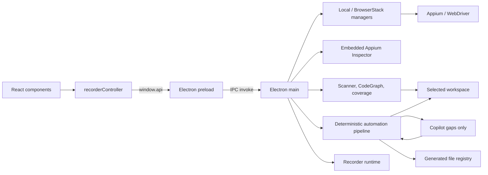

# Arquitectura

## Propósito

Appium Recorder inspecciona y manipula una app móvil, registra acciones,
construye Gherkin y genera automatización compatible con `fwk-mobile-test`.
Funciona desde su propio clon durante desarrollo y como `.app` macOS, siempre
enlazado a una raíz local válida de `fwk-mobile-test`.

## Vista de componentes

El límite de confianza está entre `preload` y `main`: el renderer recibe una
API limitada, mientras que filesystem, red de BrowserStack, procesos y driver
permanecen en el proceso principal.

## Capas y responsabilidades

### Renderer

- `renderer/components/`: estructura visual React.
- `renderer/App.tsx`: montaje y ciclo de vida principal. Llama a
  `initializeRecorder()` en el efecto de montaje y a `disposeRecorder()` en su
  limpieza, para que un remount (por ejemplo React StrictMode en desarrollo)
  no acumule listeners duplicados.
- `renderer/controller/recorderController.js`: **composition root**. Construye
  el estado compartido (`state`), instancia cada feature bajo
  `renderer/features/<nombre>/` con sus dependencias explícitas, llama a
  `mount()` una única vez por feature y expone `disposeRecorder()` para
  desmontarlas. No registra `addEventListener` directamente ni concentra
  lógica de negocio.
- `renderer/features/`: una carpeta por feature, cada una con un único módulo
  que exporta `create<Nombre>Feature(deps)` y devuelve `{ mount, unmount, ... }`:
  - `configuration/`: catálogo del framework (ambiente/squad/feature scope),
    configuración de sesión local y BrowserStack, subida de apps y
    arranque/cierre de sesión.
  - `recording/`: lista de steps grabados y ejecución de la acción actual
    (construir y enviar el step a `api.executeStep`).
  - `inspector/`: Hierarchy Viewer (modal XML local), lanzamiento del Appium
    Inspector embebido y captura/verificación de selectores explícitos
    (inspección por click e interacción manual).
  - `platform-completion/`: cobertura de una grabación existente, cola de
    asignación de locators y el onboarding de sesión (caso nuevo / completar
    grabación / reprocesar-refinar).
  - `generation/`: preview/generación determinista heredada (cuatro capas sin
    agente) y el "code review workspace" compartido con la revisión de una
    propuesta de automatización.
  - `review/`: el wizard "Enlazar" (constructor de escenario Gherkin), el
    pipeline de automatización con agente (progreso, decisiones de QA) y la
    revisión/revalidación de una propuesta antes de aplicarla. El progreso se
    pinta por agente en `#automationAgentStages` (una fila por Lorem, Zorem y
    Sumrak con estado, evidencia en KB, ejecución por caché/determinista,
    `budgetWarnings` y corte por hang stop); Lorem y Zorem pueden estar en
    curso a la vez y el resumen dice "trabajan en paralelo". El panel
    `#qaObservationsPanel` muestra tanto erratas del texto de la app
    (`ui-text-quality`) como verificaciones con XPath genérico
    (`weak-assertion`), y el reporte copiable las incluye; ninguna bloquea.
  - `shared/domHelpers.js`: helpers de DOM genéricos (`disableBtn`,
    `enableBtn`, `updateDeviceScreen`, `escapeHtml`, `setLabelState`) sin
    estado propio, reutilizados por varias features en vez de duplicarlos.
- `renderer/global.d.ts`: contrato TypeScript de la API expuesta.
- `renderer/recorder.css`: layout, scroll y estados visuales.

React es dueño del markup, pero las features todavía dependen de IDs JSX (son
parte del contrato: no se renombran ni eliminan sin actualizar bindings y
pruebas). Cada feature registra sus propios listeners en `mount()` y los
retira en `unmount()`; el estado que dos o más features necesitan leer o
escribir vive en el objeto `state` que arma el composition root y se pasa por
referencia — ninguna feature lo copia ni declara un singleton propio a nivel
de módulo. Cuando una feature necesita invocar comportamiento de otra (por
ejemplo, `platform-completion` abriendo el Appium Inspector que expone
`inspector`), el composition root inyecta esa función como dependencia
explícita; las referencias circulares entre features hermanas (inspector ↔
platform-completion, generation ↔ review) se resuelven con una variable `let`
asignada antes de que el callback se invoque, nunca con un import cruzado
entre carpetas de feature. Leer el `.value`/`.textContent` de un elemento que
otra feature declara está permitido (el DOM ya es el estado del formulario);
lo que no se duplica ni comparte sin pasar por `state` es la lógica de negocio
ni las variables mutables. Solo `features/shared/` puede importarse entre
features; ninguna importa un archivo interno de otra ni de `core/`
(`scripts/check-architecture.js` lo bloquea con el código
`renderer-core-import`).

### Bridge y proceso principal

- `recorder/src/preload.ts`: allowlist de funciones IPC.
- `recorder/src/main.ts`: composition root. Crea la ventana, resuelve el
  ciclo de vida de la app, registra el protocolo del Inspector embebido,
  construye los servicios/estado compartidos y delega el registro de cada
  canal IPC a la familia correspondiente bajo `recorder/src/ipc/`. No declara
  ningún `ipcMain.handle`/`ipcMain.on` propio.
- `recorder/src/ipc/runtimeState.ts`: `RecorderRuntimeState`, el único estado
  mutable compartido (sesión activa, plataforma, steps grabados, ventanas,
  paquete/preview de automatización, candidatos pendientes del Inspector).
  `main.ts` construye una única instancia y la inyecta por referencia en el
  contexto de cada familia; ninguna familia crea ni duplica ese estado.
- `recorder/src/ipc/recordingSync.ts`: sincroniza el recording activo con los
  steps grabados; lo comparten `interactionHandlers` y `automationHandlers`.
- `recorder/src/ipc/workspaceHandlers.ts`: catálogo del framework, catálogo de
  squad, cobertura de escenarios existentes y asignación de valores de
  locator.
- `recorder/src/ipc/sessionHandlers.ts`: dispositivos, credenciales y
  arranque/cierre de sesión local y BrowserStack. Dueño de `closeOwnedSession`.
- `recorder/src/ipc/inspectorHandlers.ts`: apertura/focalización del Inspector
  embebido, su handshake versión 3 y la revalidación del elemento usado.
  Dueño de `closeEmbeddedInspectorResources`.
- `recorder/src/ipc/interactionHandlers.ts`: screenshot, page source, tap,
  swipe, verificación de selector y ejecución/edición de steps grabados.
- `recorder/src/ipc/automationHandlers.ts`: el pipeline de automatización
  completo — preparar paquete, resolver decisiones de QA, lanzar/importar la
  respuesta del agente, validar, aplicar sobre el framework y promocionar
  memoria.
- `recorder/src/ipc/generationHandlers.ts`: generación heredada de las cuatro
  capas sin pasar por el pipeline de automatización con agente, y el Gherkin
  con steps enlazados. Sus dos handlers de escritura final permanecen detrás
  de `RECORDER_ENABLE_GENERATION`.
- `recorder/src/mobileInspector.ts`: jerarquía y selección visual.
- `recorder/src/featureGenerator.ts`: apoyo a previsualización Gherkin.

`BrowserWindow` debe conservar `nodeIntegration: false` y
`contextIsolation: true`.

El Inspector oficial se consume desde el fork controlado fijado como submódulo
en `vendor/appium-inspector`. Su bundle browser no se versiona: se compila en la
caché local con `npm run inspector:build`. Una `BrowserWindow` aislada sirve un
host y el bundle mediante orígenes locales `appium-recorder://host` y
`appium-recorder://inspector`; no acepta navegación ni ventanas nuevas. El
renderer principal nunca recibe WebDriver ni datos de sesión: solo el selector
confirmado explícitamente por el protocolo `appium-inspector:embedded` versión
3 mediante `appium-inspector:element-used`. El host delega al iframe únicamente
`clipboard-write` para copiar selectores; no concede lectura del portapapeles ni
otras capacidades y conserva sandbox, CSP y orígenes distintos.

### Dominio (`core/`)

> La tabla lista responsabilidades por nombre lógico; la ubicación física de
> cada módulo (`core/<módulo>/<capa>/<archivo>.ts`) está en
> [ADR-0001](adr/0001-modular-core-architecture.md). Las fachadas planas de
> compatibilidad (`core/<nombre>.ts`) se retiraron: cada nombre de abajo se
> importa desde la API pública de su módulo (`core/<módulo>` o
> `core/<módulo>/contracts`), nunca desde una ruta plana.

| Área | Módulos principales | Responsabilidad |
|---|---|---|
| Sesión | `appiumDriverManager`, `browserStackDriverManager`, `mobileStepExecutor` | Conectar, capturar, tocar, gestos y ejecutar acciones |
| Workspace | `projectPaths`, `workspaceAdapter`, `frameworkScanner` | Resolver la raíz padre y el catálogo del framework |
| Automatización | `automationRecordingStore`, `deterministicResolver`, `automationContextProjections`, `automationPackageBuilder` | Recording, plan, hints/gaps derivados y contexto mínimo |
| IA acotada | `agentOrchestrator`, `copilotCliAdapter`, `automationAgentLauncher`, `automationContracts` | Modo `manual` (handoff en Terminal) o `automatic` (dos pasadas controladas por contratos y budgets) |
| Validación/memoria | `automationResponseValidator` + `rules/` (familias), `automationMemory` | Validar, reparar una vez y versionar score 100 |
| Aplicación | `automationApplier` | Ampliar `update` con patch aditivo, escribir `create`, registrar; el handler IPC solo lo invoca |
| Generación | `fwkMobileGenerator`, `generationQuality` | Construir previews y contenidos |
| Seguridad de salida | `outputValidator`, `generatedFileRegistry` | Rutas permitidas, sintaxis, hashes y escritura segura |
| Análisis | `reuseAnalyzer`, `scenarioCoverageAnalyzer` | Impacto de steps y cobertura Android/iOS |
| Indexación | `codeGraph`, `frameworkQueryService`, `recorderCodeGraph`, exporters | Inventario incremental único y consultas acotadas del framework; grafo separado del propio recorder |
| Política contextual | `gapQueryPolicy` | Autorizar consultas solo para gaps abiertos, con allowlist, deduplicación y presupuesto |
| Observabilidad | `agentRunStore` | Métricas seguras por ejecución en `agent-run.json` |
| Modelo | `models` | Acciones, steps y tipos compartidos |

En generación determinista, `gap-resolutions.json` no reemplaza al plan con
texto libre. Una decisión `reuse` selecciona `{file,module,name}` de los
candidatos autorizados y el recorder deriva `effective-generation-plan.json`.
`DeterministicGenerator` y `AutomationResponseValidator` consumen ese mismo
plan efectivo; así reutilización, trazabilidad y validación tienen una sola
fuente de verdad.

## Workspace

La raíz se resuelve, en orden, desde `FWK_MOBILE_ROOT`, el workspace persistido,
un framework padre válido —solo para compatibilidad durante desarrollo— o un
selector nativo de carpeta. Todas las alternativas pasan por la misma
validación de estructura y por
`core/workspace/infrastructure/projectPaths.ts`. Los servicios se construyen
solo después de configurar esas rutas. El `.app` guarda recordings, cache,
memoria y manifiesto Appium en su runtime escribible; únicamente los artefactos
aprobados se escriben en el framework seleccionado.

## Flujos principales

### Arranque y sesión

1. Se resuelve e inicializa el workspace.
2. Antes de abrir la ventana se eliminan únicamente placeholders de recordings
   que tengan manifest válido, cero acciones y ningún scenario ni evidencia.
3. El scanner entrega ambientes, squads, apps y conteos sin revelar valores
   sensibles de `config/envs/.env.*` del framework.
4. El usuario elige conexión local o BrowserStack.
5. `main` crea el driver correspondiente y fija la plataforma de la sesión.
6. Screenshot, XML, taps, swipes y ejecución pasan siempre por IPC.
7. En modo embebido, `main` entrega al Inspector la sesión local ya creada. El
   recorder conserva propiedad exclusiva y cierra la sesión; el Inspector solo
   se adjunta mediante un proxy loopback efímero que acepta exclusivamente el
   origen local del Inspector y las rutas de la sesión activa. El Inspector
   mantiene la selección local hasta que el QA pulsa **Usar en Recorder**. Solo
   entonces emite el selector confirmado; el recorder oculta la ventana sin
   destruirla y conserva sesión, proxy y selección para la siguiente apertura.

El evento v3 puede traer múltiples candidatos, pero el recorder persiste un
único selector elegido por QA. `main` revalida ese selector contra la sesión
activa y comprueba que el par real `(TypeLocator, valor)` lo reconstruya. Si no
cumple, la importación se rechaza con diagnóstico. Nunca se persisten atributos,
XML, screenshots, source, capabilities ni credenciales.

### Caso nuevo con agente de automatización

1. El recorder persiste acciones ordenadas, la intención funcional escrita por
   el QA y selectores comprobados. El QA no asigna nombres técnicos de locator.
2. El usuario define objetivo y aceptación; no redacta Gherkin manualmente.
3. `ReuseAnalyzer` construye una vista compacta de escenarios, steps, Screen
   Objects y locators del squad, Home y commons. Además de bundles conectados
   por Feature → Steps → Screen → Locator, expone relaciones parciales
   Screen → Locator indexadas por CodeGraph. Estas últimas solo se adoptan con
   cobertura funcional suficiente para evitar falsos positivos. Los selectores
   se normalizan al par `(TypeLocator, valor)` del framework (ver
   `locatorStrategy`).
4. `DeterministicResolver` decide reuse/create/builtin, detecta casos equivalentes
   y fija las cuatro rutas. Puede crear Feature/Steps y planificar Screen y
   Locators existentes como `update`; si sus APIs cubren todo el recording,
   esas dos capas se conservan sin cambios.
5. Se escriben `generation-plan.json`, `reuse-context.json`,
   `collision-report.json`, contextos resuelto/no resuelto y contrato
   bajo `runtime/recordings/<id>/generation/automation`.
   `package-provenance.json` fija mediante hashes canónicos la grabación
   original, el escenario empaquetado y el plan. Al importar, `main` compara
   esas identidades sin volver a resolver contra el framework mutable; así una
   primera aplicación no invalida una corrección posterior de Copilot.
   `application-receipt.json` registra el hash posterior de cada ruta aplicada.
   Una corrección solo puede reemplazar esos archivos si continúan intactos; los
   patches sobre archivos compartidos se recalculan desde su baseline original.
   Preparar nuevamente una grabación reinicia antes todos los artefactos
   mutables de la corrida anterior —respuesta, plan efectivo, consultas,
   reparación, validación, logs y baselines—. Solo `history/` se conserva;
   por ello un fallo temprano del resolver nunca deja una respuesta antigua
   disponible para importar.
6. Si existe un caso equivalente con sus cuatro capas, se conserva localmente y
   no se invoca al agente. La memoria de calidad 100 también se reutiliza.
7. Según `RECORDER_AGENT_EXECUTION_MODE`, la UI abre Terminal en handoff manual
   o ejecuta el orquestador automático. El flujo predeterminado tiene un owner
   explícito, **Derek**, que conserva el orden y los handoffs definidos por el
   recorder. Antes de delegar, el recorder materializa en memoria las cuatro
   capas y guarda `deterministic-draft.json`. Este borrador local da forma y
   trazabilidad inmediatas al caso, pero no es una respuesta aplicable ni una
   restricción de reutilización. Derek delega tres responsabilidades aisladas: **Lorem**
   (`behavior-author`) genera Feature y Steps, **Zorem** (`interaction-author`)
   genera Screen Object y Locators, y **Sumrak** (`integration-reviewer`)
   unifica las cuatro capas en el `agent-response.json` visible para el QA.
   Presupuesto por etapa: cada `LayeredGenerationStageReport` lleva `budget`
   (`maxDurationMs`, `maxContextBytes`, `hangStopMs`), `contextBytes` (todo lo
   que hay en la carpeta del agente), `evidenceBytes` (solo evidencia del
   framework), `budgetWarnings` y `timedOut`. El presupuesto se reporta y se
   muestra al QA; no recorta evidencia. La sesión de cada rol se corta al hang
   stop (`RECORDER_AGENT_HANG_STOP_MS`, 1 h), igual que en el pipeline
   mono-agente; antes cada etapa moría a los 300 s y una respuesta casi lista
   se perdía.
   Solo Zorem recibe `shell(node|python)` para validar su Screen Object; Lorem
   y Sumrak corren sin shell, así la prohibición de explorar el framework deja
   de depender del prompt.
   Lorem, Zorem y Sumrak se ejecutan en modo headless con perfiles custom-agent
   y sesiones nombradas `Derek/<recordingId>/<agente>`; no abren Terminal ni
   dependen de una sesión interactiva. Cada delegado recibe un manifiesto
   acotado, trabaja bajo `agents/<nombre>` y publica un handoff por ruta, tamaño
   y SHA-256. Sumrak rechaza artefactos que cambiaron después del handoff. El
   recorder impone byte por byte los cuatro contenidos publicados por Lorem y
   Zorem: Sumrak solo aporta resoluciones y trazabilidad. La respuesta final pasa por
   `AutomationResponseValidator` antes de aplicarse.
   Lorem entrega además su interfaz de `screenMethod` directamente a Zorem.
   Ante un fallo, Derek clasifica el feedback por propietario y reejecuta solo
   la capa afectada. Durante una reparación, cada escritura se valida en vivo;
   si Copilot cierra con feedback pendiente, Derek relanza únicamente ese autor
   en una ronda `feedback-N`. Derek dirige cada error por el `code` de la regla
   (la misma tabla por capa con la que proyecta `validation-contract.json`);
   solo un error sin código se clasifica por su texto, y uno que nadie
   reconoce llega a los tres. Sumrak debe conservar las decisiones deterministas
   del plan: no puede convertir `create` en `reuse` por similitud de nombre.
   Para evitar repetir minutos de inferencia, Lorem y Zorem mantienen un caché
   incremental local bajo `generation/.agent-cache`, fuera del paquete
   `automation` reconstruible e indexado por hashes de inputs, prompt y modelo.
   Los handoffs se vuelven a verificar al restaurar la salida.
   Cuando existe `deterministic-draft.json`, Lorem y Zorem corren **en
   paralelo**: Derek publica el `actionTrace` del borrador como contrato
   provisional (`agents/derek/behavior-result.json`, con handoff verificado) y
   Zorem implementa esa interfaz mientras Lorem redacta; Lorem tiene la
   instrucción de conservar esa interfaz. Al terminar ambos, si la huella
   `screenMethod`/`locatorName` de Lorem difiere del contrato, Zorem se
   sincroniza con el resultado real (`parallelAuthors: false` fuerza la
   secuencia). El adaptador de Copilot mantiene varias sesiones vivas y
   `cancel()` las corta todas. Zorem recibe el borrador de un archivo `update`
   como sus adiciones sobre `baseline` (getters, métodos, claves), no como el
   archivo completo que ya está en `baselines/`.
   Una corrección de Gherkin solo invalida Zorem cuando cambia la interfaz
   `screenMethod`/`locatorName` de `actionTrace`. Cuando todos los gaps abiertos
   ya tienen decisión fijada por el plan (`create`/`reuse` por secuencia, o
   `gap-extend-existing-artifacts`), Derek firma esas resoluciones, ensambla la
   respuesta directamente y ejecuta el mismo validador oficial sin abrir sesión
   de Sumrak; es el caso normal, porque el integrador rechazaría cualquier
   decisión distinta de la del plan. Sumrak queda reservado para gaps sin
   decisión fijada, y aun entonces Derek fusiona sus resoluciones con las que
   ya firmó. Los tres roles reciben `gaps.json` proyectado: solo los gaps que
   exigen juicio y sin `allowedQueries`/schemas (en este pipeline no hay ronda
   de consultas); su copia de `generation-plan.json` lleva `unresolvedGapIds`
   filtrado y `fixedGapResolutions`. El `gaps.json` del paquete no cambia: es
   el que revisa el QA. Zorem recibe `reuse-context.elements` sin el código de
   los getters (ya viaja íntegro en `baselines/`); Sumrak recibe solo las
   reglas de integración del catálogo y la reutilización sin elementos, y los
   autores no reciben reglas de integración.
   Cada rol usa una memoria aislada descrita por `agent-memory.json`. Lorem
   recibe únicamente evidencia funcional para `feature/steps`; Zorem recibe
   selectores, APIs y baselines de `screen/locators`; Sumrak recibe los dos
   handoffs y el mínimo contractual para integrar. Lorem y Zorem reciben solo
   su mitad proyectada de `deterministic-draft.json`; Sumrak no recibe el draft
   porque su fuente son los resultados definitivos de los autores.
   `unresolved-context.json` queda fuera de todos los workspaces de agentes por
   ser compatibilidad histórica ya sustituida por `gaps.json` y queries.
   `reuse-context`, hints,
   resultados de queries y reglas de validación se proyectan por ownership,
   sin copiar el catálogo completo del framework. El reporte por etapa publica
   `contextBytes`, `contextFiles` y `assignedLayers`. La respuesta completa se
   cachea solo después de superar el validador oficial, por lo que reducir
   memoria nunca relaja el contrato ni cambia silenciosamente el resultado.
   El orquestador anterior de dos pasadas (`query-requests/query-results` y
   respuesta semántica) se conserva como estrategia `deterministic` de
   compatibilidad mediante `RECORDER_AGENT_PIPELINE=deterministic`.
   La revisión semántica incluye además `testDesignReview`, una revisión funcional estructurada.
   Contrasta objetivo, criterio de aceptación,
   acciones y aserciones. Si una interacción solo verifica que existe el control
   o carece de una aserción posterior sobre el resultado de negocio, Lorem
   publica una sugerencia en `test-design-review.json`; no bloquea la respuesta
   ni obliga al QA a volver a grabar.
   El roast no pertenece a PASS 2. Si la preferencia **QA Roast Mode** está
   activa, `CopilotQaRoastGenerator` usa después el puerto
   `QaRoastGenerationService` para abrir una sesión headless independiente con
   contexto sanitizado. Su fallo es no bloqueante y el renderer siempre conserva
   el diagnóstico estructurado.
8. `AutomationResponseValidator` exige cuatro capas, trazabilidad y `Then`, y
   bloquea colisiones contra el framework aunque el agente ignore el contexto.
   La clase no contiene reglas: compone en un orden fijo las familias de
   `core/validation/infrastructure/rules/` sobre un unico reporte
   (`envelope`, `syntax`, `completion`, `layer`, `gap`, `locatorContract`,
   `existingAutomation` y, ya sobre el preview, `output`, `gherkinQuality`,
   `codeStructure`, `updateSafety`, `frameworkCollision`). Ese orden es parte
   del contrato: la deduplicacion final conserva la primera aparicion de cada
   `(code, message, file)`. El catalogo de reglas que viaja al paquete se
   construye leyendo el orquestador **y** ese directorio
   (`readValidatorRuleSource`), asi que una regla nueva vive en su familia y
   aparece sola en el contrato.
   Los rellenos de plataforma solo aceptan la identidad determinista completa
   `(file, module, block, name, platform, sequence)` y el método trazado debe
   consumir ese getter; el patch conserva esa misma identidad hasta la escritura.
   Los completions externos se aplican incluso cuando las cuatro capas del caso
   son `create`; no dependen de que exista un `update` en el plan.
9. Puede emitirse una sola reparación dirigida a archivos afectados.
10. El usuario revisa el preview, genera y recién entonces se promociona memoria.

La generación determinista es el modo predeterminado. `legacy` permanece
únicamente como opt-in técnico mediante `RECORDER_GENERATION_MODE=legacy`.

### Observabilidad por ejecución

Cada preparación real inicia
`runtime/recordings/<id>/generation/automation/agent-run.json`. El mismo
artefacto se actualiza durante resolución, apertura manual del agente,
validación, reparación y generación, incluso si el flujo termina con error.
Registra duraciones, lecturas del índice, bytes de contexto/respuesta, intentos
de reparación y resultado. `tokensInput` y `tokensOutput` permanecen en `null`
mientras el CLI no exponga esos datos. No almacena prompts, XML, capturas,
selectores, secretos ni mensajes de error.

### Índice y consultas del framework

`CodeGraph` es la fuente autoritativa del inventario de Features, Steps, Screen
Objects y locators. Su cache compara `mtime` y tamaño por archivo: una consulta
en frío indexa el framework, una consulta caliente reutiliza todos los nodos y
una modificación reindexa únicamente los archivos cambiados antes de reconstruir
relaciones derivadas.

`FrameworkQueryService` expone respuestas JSON pequeñas para
`inspectScenario`, `findExistingScreen`, `findExistingStep`, `findExample`,
`findLocator`, `getContract`, `getHelperApi` y `validateImports`. Todas aplican
límites de resultados/bytes, devuelven rutas, símbolos, firmas y relaciones,
y reportan `cacheHit`, archivos examinados/leídos y bytes leídos. Nunca incluyen
el contenido completo de un archivo por defecto.

`ReuseAnalyzer` conserva su contrato para no romper el resolver ni el scanner,
pero obtiene del CodeGraph el inventario y la revisión del framework y cachea
el catálogo por revisión, squad, plataforma y feature scope. Ya no descubre
Steps ni Screen Objects con un segundo recorrido independiente. La migración
de sus analizadores de contenido restantes será gradual.

### Hints, gaps y política de consultas

Después del resolver, `automationContextProjections` deriva dos vistas compactas:
`hints.json` describe decisiones que ya tienen evidencia y `gaps.json` normaliza
únicamente lo que continúa faltando. Son proyecciones de `GenerationPlan`,
`resolved-context.json` y `unresolved-context.json`; no reemplazan esas fuentes.

La confianza no se estima libremente: coincidencias exactas, selectores
verificados y contratos resueltos valen `1`; las relaciones usan el score ya
calculado por el índice/resolver. Una relación sin score no genera hint.

`GapQueryPolicy` es la entrada para consultas contextuales. Sin gap abierto
rechaza antes de tocar CodeGraph. Con gap abierto solo acepta `allowedQueries`
hasta `maxQueries`, evita solicitudes idénticas y deja de consultar al resolver
el gap. Los gaps `blocked-qa` tienen presupuesto cero. En esta fase la política
se valida determinísticamente; todavía no existe orquestador ni integración CLI.

### Completar plataforma de un caso existente

1. Se listan únicamente grabaciones de `runtime/recordings` que coincidan con
   el ambiente y squad activos; no se enumeran Features del target.
2. `recordingId` identifica el caso y permite retomarlo entre sesiones.
3. El analizador reconstruye acciones → plan → locators generados y muestra la
   cobertura en el orden del recording.
4. El inspector asigna el selector al locator objetivo.
5. Se actualiza únicamente Android o iOS, según la sesión activa. El recorder
   conserva la otra plataforma, sincroniza la estrategia técnica del getter y
   reemplaza atómicamente el locator administrado en el target.
6. La propuesta persistida del recording recibe el mismo valor. Al completar
   la cola, el caso queda marcado como completo para esa plataforma y no vuelve
   a requerir Cowork ni regeneración de Feature/Steps.

### Regenerar una automatización importada

1. La UI lista únicamente recordings con propuesta validada al 100% y las
   cuatro capas ya presentes en el workspace.
2. El QA selecciona el recording y describe el refinamiento funcional.
3. El recorder guarda la versión anterior bajo
   `generation/automation/history/regeneration-NNN`, conserva `recordingId` y
   fija un nuevo `planId` para impedir importar accidentalmente la respuesta
   anterior.
4. El agente recibe `baseline-response.json`, el plan y el contexto mínimo; no
   vuelve a explorar el framework ni puede cambiar rutas o selectores
   verificados.
5. La nueva propuesta atraviesa el mismo validator, preview y revisión. Solo
   archivos administrados, sin cambios externos, pueden reemplazarse
   atómicamente en el target.
6. Una generación válida crea una nueva versión de memoria y deja el estado
   del recording en `generated`, permitiendo futuras iteraciones.

## Contrato IPC

Las familias públicas son:

- catálogo/workspace (`recorder/src/ipc/workspaceHandlers.ts`): `scan-framework`,
  `get-workspace-info`, `get-squad-catalog`, `analyze-step-impact`,
  `get-existing-scenarios`, `get-scenario-coverage`, `assign-locator-value`;
- sesión local y BrowserStack (`recorder/src/ipc/sessionHandlers.ts`): devices,
  apps, credenciales y start/close;
- interacción (`recorder/src/ipc/interactionHandlers.ts`): screenshot, page
  source, element-at, tap, swipe, verify y execute;
- Inspector embebido (`recorder/src/ipc/inspectorHandlers.ts`): abrir/focalizar
  y eventos acotados de conexión, error y uso explícito del selector;
- automatización (`recorder/src/ipc/automationHandlers.ts`): preparar paquete,
  lanzar agente, importar respuesta, generar con token, preparar regeneración
  y consultar memoria;
- generación heredada (`recorder/src/ipc/generationHandlers.ts`): preview
  Gherkin, preview de archivos y generación.

Al añadir un canal, actualiza en conjunto el handler en el archivo de su
familia bajo `recorder/src/ipc/`, allowlist de `preload.ts`,
`renderer/global.d.ts`, consumidor y pruebas. `main.ts` solo construye
servicios/estado y registra la familia; nunca declara el handler directamente.
Valida todo payload en el proceso principal: TypeScript en el renderer no es
una frontera de seguridad.

## Decisiones y deuda conocida

- La mayor parte de la generación es determinista. La IA externa es opt-in y
  se limita a gaps explícitos; nunca recibe el repositorio completo.
- El renderer ya está organizado por features (`renderer/features/<nombre>/`);
  `recorderController.js` es un composition root delgado. Las features
  `inspector`, `recording` y `platform-completion` siguen compartiendo el
  panel de captura/verificación de selector (`txtSelector`, `txtVarName`, la
  cola de asignación) a través del `state` común en vez de una separación
  limpia por dueño único: esas tres piezas de UI son literalmente el mismo
  panel en pantalla y separarlas del todo sería un rediseño de producto, no
  una extracción mecánica. Documentado como deuda conocida, no como
  aplazamiento silencioso.
- `dist/` no se limpia automáticamente antes de `tsc`; nunca se usa para
  inferir la arquitectura vigente.
- Los archivos de runtime son estado local, no fuente.
