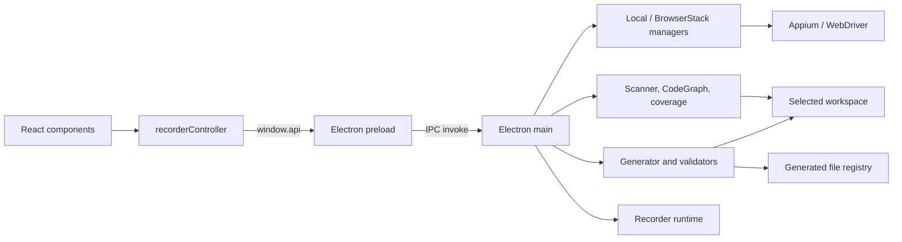

# Arquitectura

## Propósito

Appium Visual Recorder inspecciona y manipula una app móvil, registra acciones,
construye Gherkin y genera automatización compatible con un workspace elegido.
Funciona embebido en `fwk-mobile-test`, como workspace standalone o como
grabador neutral.

## Vista de componentes

El límite de confianza está entre `preload` y `main`: el renderer recibe una
API limitada, mientras que filesystem, red de BrowserStack, procesos y driver
permanecen en el proceso principal.

## Capas y responsabilidades

### Renderer

- `renderer/components/`: estructura visual React.
- `renderer/App.tsx`: montaje y ciclo de vida principal.
- `renderer/controller/recorderController.js`: estado y comportamiento
  imperativo heredado, bindings de DOM y coordinación con `window.api`.
- `renderer/global.d.ts`: contrato TypeScript de la API expuesta.
- `renderer/recorder.css`: layout, scroll y estados visuales.

React es dueño del markup, pero el controlador todavía depende de IDs JSX.
Esta convivencia debe reducirse gradualmente, componente por componente; no se
debe hacer una segunda migración total ni duplicar listeners.

### Bridge y proceso principal

- `recorder/src/preload.ts`: allowlist de funciones IPC.
- `recorder/src/main.ts`: ventana, lifecycle, composición de servicios y
  handlers IPC.
- `recorder/src/mobileInspector.ts`: jerarquía y selección visual.
- `recorder/src/featureGenerator.ts`: apoyo a previsualización Gherkin.

`BrowserWindow` debe conservar `nodeIntegration: false` y
`contextIsolation: true`.

### Dominio (`core/`)

| Área | Módulos principales | Responsabilidad |
|---|---|---|
| Sesión | `appiumDriverManager`, `browserStackDriverManager`, `mobileStepExecutor` | Conectar, capturar, tocar, gestos y ejecutar acciones |
| Workspace | `projectPaths`, `workspaceAdapter`, `frameworkScanner` | Resolver modo, raíz y catálogo del proyecto |
| Generación | `fwkMobileGenerator`, `neutralGenerator`, `generationQuality` | Construir previews y contenidos |
| Seguridad de salida | `outputValidator`, `generatedFileRegistry` | Rutas permitidas, sintaxis, hashes y escritura segura |
| Análisis | `reuseAnalyzer`, `scenarioCoverageAnalyzer` | Impacto de steps y cobertura Android/iOS |
| Indexación | `codeGraph`, `recorderCodeGraph`, exporters | Relaciones del framework y del propio recorder |
| Modelo | `models` | Acciones, steps y tipos compartidos |

## Modos de workspace

La selección se resuelve en este orden: variables de proceso o `.env`,
`config/workspace.json`, autodetección.

| Modo | Target por defecto | Capas completas | CodeGraph |
|---|---|---:|---:|
| `fwk-mobile` | proyecto padre detectado o `TARGET_PROJECT` | Sí | Sí |
| `standalone` | `workspace/` dentro del recorder | Sí | Sí |
| `neutral` | `runtime/neutral-workspace` | No; export portable | No |

Todas las rutas operativas nacen en `core/projectPaths.ts`. El adaptador activo
inicializa o valida el target, sin dispersar condiciones de modo por la UI.

## Flujos principales

### Arranque y sesión

1. Se resuelve e inicializa el workspace.
2. El scanner entrega ambientes, squads, apps y conteos sin revelar valores
   sensibles del `.env`.
3. El usuario elige conexión local o BrowserStack.
4. `main` crea el driver correspondiente y fija la plataforma de la sesión.
5. Screenshot, XML, taps, swipes y ejecución pasan siempre por IPC.

### Caso nuevo

1. Se registran acciones con selector lógico y valor opcional.
2. Se redactan filas Gherkin.
3. Al continuar se analiza impacto contra definiciones y escenarios existentes.
4. El usuario enlaza acciones con cada fila.
5. Se depuran metadatos y nombres durante la revisión.
6. Preview construye las cuatro capas y devuelve token + contenidos.
7. Solo el contenido revisado y autorizado puede escribirse.

### Completar plataforma de un caso existente

1. Se elige Feature y Scenario.
2. El analizador recorre Gherkin → Step Definition → método → locator.
3. La cobertura se muestra en orden Gherkin y como árbol por step.
4. El inspector asigna el selector al locator objetivo.
5. Se actualiza únicamente Android o iOS, según la sesión activa.

## Contrato IPC

Las familias públicas son:

- catálogo/workspace: `scan-framework`, `get-workspace-info`,
  `get-squad-catalog`;
- impacto/cobertura: `analyze-step-impact`, `get-existing-scenarios`,
  `get-scenario-coverage`, `assign-locator-value`;
- sesión local y BrowserStack: devices, apps, credenciales y start/close;
- interacción: screenshot, page source, element-at, tap, swipe, verify y execute;
- generación: preview Gherkin, preview de archivos y generación con token.

Al añadir un canal, actualiza en conjunto handler de `main.ts`, allowlist de
`preload.ts`, `renderer/global.d.ts`, consumidor y pruebas. Valida todo payload
en el proceso principal: TypeScript en el renderer no es una frontera de
seguridad.

## Decisiones y deuda conocida

- La generación es local y basada en reglas; no depende de IA externa.
- `recorderController.js` sigue siendo grande e imperativo. Las extracciones
  futuras deben mantener un único dueño por estado y evento.
- `dist/` no se limpia automáticamente antes de `tsc`; nunca se usa para
  inferir la arquitectura vigente.
- Los archivos de runtime y los targets standalone son estado local, no fuente.

